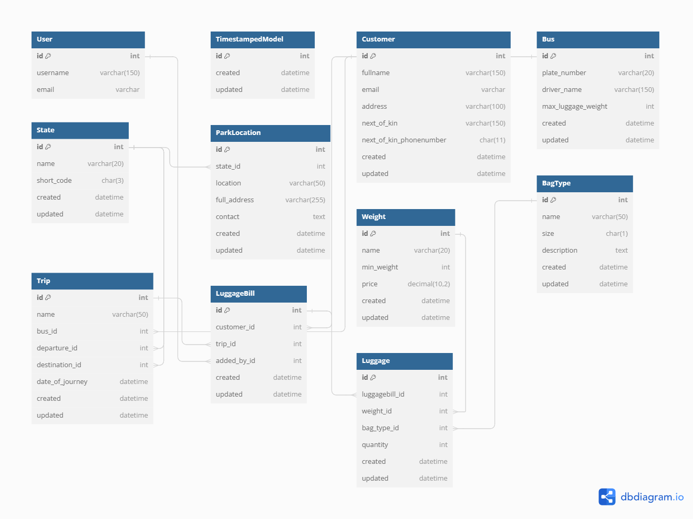

# Luggage Management System

<!--  -->


**This Luggage Management System is designed to facilitate the management of luggage for trips, particularly in the context of bus transportation services. It enables the recording and billing of luggages associated with specific customers and trips.**

## Contents

- [About the Project](#about-the-project)
  * [How does it Work](#how-does-it-work)
- [Getting Started](#getting-started)
  * [Built with](#built-with)
  * [Installation](#installation)
- [Running Tests](#running-tests)
- [Contributing](#contributing)
- [Support](#support)
- [License](#license)
- [Contact](#contact)

## About The Project

This is designed for transportation companies offering bus services, and some of its features are listed below:

- **Customer Management**: Allows the creation and management of customer profiles.

- **Bus Management**: Facilitates the addition and management of bus details, including plate numbers and driver information.

- **Trip Management**: Enables the creation and scheduling of trips, specifying departure, destination, and date of journey amongst other relevant information.

- **Luggage Recording**: Record luggage details such as weight, type, and quantity associated with specific trips and customers.

* **Billing**: Generates bills for luggage based on weight categories and quantities for the traveling customers.



### How does it Work

Staff members of the bus company will be assigned to make use of the administrative interface to manage luggage-related data, and also register customer details.

For every intending customer that wants to travel, the admin staff will record the details of whatever luggage the customer intends to carry alongside the trip information and bus they are scheduled to go with. This will generate a luggage bill for the intending passenger to know the cost for their luggages.

<!--  -->

## Getting Started

### Built with

- **Django**: This Python web framework is used for building the backend logic, including models for storing customer and luggage-related data. The in-built Django Admin Interface is the primary interface used to manage the functionalities of this application.

### Installation

_Follow the steps below to get the program working on your system locally. These steps are tailored for users developing on Linux OS with Python installed already._

1. Clone the repo
   ```sh
   git clone https://github.com/Pythonian/django_luggage.git
   ```
2. Change into the directory of the cloned repo
   ```sh
   cd django_luggage
   ```
3. Setup a Python virtual environment and activate it
   ```sh
   make venv
   source venv/bin/activate
   ```
4. Install project requirements
   ```sh
   make install
   ```
5. Copy and edit environment variables with desired values
   ```sh
   cp .env.example .env
   ```
6. Run database migrations
   ```sh
   make migrate
   ```
7. Create an admin superuser
   ```sh
   make admin
   ```
   _Note: Use `admin` for both the `username` and `password`, and skip entering the `email`. Also type `y` to bypass Password validation._

8. Populate the database with fake data (Optional)
   ```sh
   make populatedb
   ```
9. Run the development server
   ```sh
   make run
   ```
10. Visit the Admin dashboard in your browser, and login with the credentials created in step (7)
   ```sh
   127.0.0.1:8000/admin/
   ```

## Running Tests

To run tests, run the following command

```bash
   make test
```

## Contributing

Contributions are always welcome! Any contributions you make are **greatly appreciated**.

If you have a suggestion that would make this project better, please fork the repo and create a pull request. You can also simply open an issue with the tag "enhancement".

Don't forget to give the project a star! Thanks again!

1. Fork the Project
2. Create your Feature Branch (`git checkout -b feature/AmazingFeature`)
3. Commit your Changes (`git commit -m 'Add some AmazingFeature'`)
4. Push to the Branch (`git push origin feature/AmazingFeature`)
5. Open a Pull Request

## Support

If you encounter any bug or problem while using the project, please [open an issue](https://github.com/Pythonian/django_luggage/issues)

## License

This project is licensed under the [MIT License](LICENSE.md).

## Contact

If you have any questions, suggestions, or feedback, feel free to reach out to me

Seyi Pythonian - [@Ajibel](https://twitter.com/Ajibel) - [seyipythonian@gmail.com](mailto:seyipythonian@gmail.com)
